<div align="left"> <a href="./README.md">🇫🇷 Français</a> | <a href="./README.en.md">🇬🇧 English</a> </div>

---
<a name="top"></a>

# GestEpice: Product Sales Platform for INPT Students

# [Demo Video](https://drive.google.com/file/d/1ANz-nvzCub14DQWWOA09ZG-OSu8fzNpx/view?usp=drive_link)
If the link doesn't work, please copy and paste it into your browser's address bar.

## Table of Contents

1. [Introduction](#introduction)
   - [Project Objectives](#project-objectives)
   - [General Description](#general-description)
2. [Technologies and Tools Used](#technologies-and-tools-used)
3. [Architecture and Design](#architecture-and-design)
   - [Class Diagram](#class-diagram)
   - [Use Case Diagram](#use-case-diagram)
4. [Functional Description](#functional-description)
   - [Client](#client)
   - [Administrator](#administrator)
   - [Supplier](#supplier)
5. [Non-Functional Description](#non-functional-description)
6. [Development Best Practices](#development-best-practices)
   - [Design Patterns](#design-patterns)
   - [SOLID and Clean Code Compliance](#solid-and-clean-code-compliance)
   - [PEP8 Compliance](#pep8-compliance)
   - [Linters Usage](#linters-usage)
   - [Git Workflow](#git-workflow)
   - [Unit Testing](#unit-testing)
7. [Multilingual Support](#multilingual-support)
8. [Backend Structure](#backend-structure)
9. [Getting Started](#getting-started)
   - [Prerequisites](#prerequisites)
   - [Installation and Configuration](#installation-and-configuration)
10. [Application Preview](#application-preview)
11. [Database](#database)
    - [Conceptual Model](#conceptual-model)
    - [Entity-Relationship Diagram (ERD)](#entity-relationship-diagram-erd)
12. [Contributors](#contributors)

---

## Introduction

### Project Objectives
The project aims to develop a performant and secure e-commerce platform that meets the needs of three main user types: Clients, Administrators, and Suppliers. The main objectives are:
- **Provide an intuitive user experience** through a simple and fluid interface.
- **Automate business processes** such as product management, orders, and reports.
- **Ensure data security** using modern encryption and user management techniques.
- **Enable easy scalability** by adopting a modular architecture that follows best practices.
- **Facilitate multilingual integration** to make the platform accessible to a wide audience.

### General Description
The e-commerce platform is a complete and modular web application designed to meet the varied needs of users. It relies on:
- **A robust backend** developed with **Django**, coupled with a **MySQL** relational database, ensuring operational reliability and data management.
- **A modular architecture** compliant with SOLID and CLEAN CODE principles, facilitating maintainability and project extensibility.
- **A generic multilingual system**, allowing easy addition of new languages for better accessibility.
- **An advanced security mechanism**, integrating password hashing and user role management (Clients, Administrators, Suppliers).
- **Custom features**:
  - **For Clients**: Product search, order management, and purchase tracking.
  - **For Administrators**: Product and category management, statistical dashboard, and chat interaction.
  - **For Suppliers**: Product addition, order tracking, and sales report consultation.

This project is designed to be performant, maintainable, and easily deployable in a production environment.

<div align="right">
  <a href="#top">⬆ Back to top</a>
</div>

---

## Technologies and Tools Used

The project relies on a modern technology stack and robust tools to ensure its performance, maintainability, and security. Here are the main elements used:

### Backend
- 
- 
- 

### Frontend
- &nbsp;&nbsp;
- 

### DevOps and Build Tools
- 
- 
- 
- 

### Testing and Quality
- 
- 

### Security
- 
- 

### Additional Tools
- 
- 

This combination of technologies ensures a robust, maintainable, and easily extensible application.

<div align="right">
  <a href="#top">⬆ Back to top</a>
</div>

---

## Architecture and Design

### Class Diagram

*Description*  
The class diagram below represents the conceptual structure of the e-commerce project, showing the main entities (Client, Admin, Supplier, Product, Order, Review, and Chat) and their relationships. It is essential for understanding data organization and interactions within the system.

*Diagram*
<div align="center" style="display: flex; justify-content: center; align-items: center; text-align: center;">
  
</div>

---

### Use Case Diagram

*Description*  
The use case diagram below represents the main interactions between system actors (Client, Admin, Supplier) and the functionalities they can perform. Use cases common to multiple actors (such as "Register and log in" and "Contact via chat") are also highlighted.

*Diagram*
<div align="center" style="display: flex; justify-content: center; align-items: center; text-align: center;">
  
</div>

<div align="right">
  <a href="#top">⬆ Back to top</a>
</div>

---

## Functional Description

### Users and Roles

#### **Client**
The client can:
- Register and log in.
- Modify their profile information.
- Add a review about the Gestepice service.
- Add a review and recommend products.
- Search for products by category and/or keyword.
- Consult their order history and print invoices.
- Add products to cart and place an order.
- Contact the administrator via real-time chat.

#### **Administrator**
The administrator can:
- Consult various grocery store statistics via an **interactive dashboard**.
- Add, modify and delete products and categories.
- Consult the list of placed orders.
- Consult the list of products made by INPT students and manage payments for them.
- Recharge user balances.
- Respond to customer concerns via chat.

#### **Supplier**
The supplier can:
- Register and log in to access their dedicated space.
- Add, modify and delete their products available on the platform.
- Consult customer orders for their specific products.
- Track payment status for orders of their products.
- Receive notifications for customer orders.
- Manage inventory and see alerts for out-of-stock items.
- Download a monthly sales report for their products.

<div align="right">
  <a href="#top">⬆ Back to top</a>
</div>

---

## Non-Functional Description

### Technical Requirements
1. **Architecture**:
   - Based on the Django MVC framework.
   - Modular and reusable structure with Django apps.

2. **Performance**:
   - Response time under 2 seconds for all user requests.

3. **Security**:
   - Secure password hashing with Python's hashing function (`hashlib`).
   - User input validation to prevent common vulnerabilities such as SQL injection and XSS.
   - Use of Django for session and authentication management.
   - Prevention of CSRF and XSS attacks via Django middlewares.

5. **Portability**:
   - Compatible with major browsers (Chrome, Firefox, Edge).

6. **Database**:
   - MySQL for the relational database.

<div align="right">
  <a href="#top">⬆ Back to top</a>
</div>

---

## Multilingual Support

Django supports internationalization (**i18n**) for developing multilingual applications. Here are the key steps implemented to integrate multilingual support in this project:

1. **Marking translatable strings**:
   - In **templates**: Translatable strings are wrapped with ``.
   - In **Python code**: Strings are marked with `_()`.

2. **Extracting translatable strings**:
   - The following command was used to generate `.po` files containing translatable strings:
     ```bash
     django-admin makemessages -l <language_code>
     ```
     > Example: `django-admin makemessages -l fr` for French.

3. **Adding translations**:
   - The generated `.po` files were filled with the necessary translations.

4. **Compiling translation files**:
   - The `.po` files were compiled into `.mo` files using the command:
     ```bash
     django-admin compilemessages
     ```

5. **Automatic language selection**:
   - **LocaleMiddleware** was enabled so Django automatically selects the language based on:
     - User preferences.
     - URL (if configured).

6. **Adding a language selector**:
   - An interface was implemented to allow users to easily change languages.

The application adapts its content to the user's preferred language, providing a smooth and personalized experience.

<div align="right">
  <a href="#top">⬆ Back to top</a>
</div>

---

## Development Best Practices

### Design Patterns
**Design patterns** such as Singleton, DAO, and MVC were used to structure the code in a modular way, facilitating reuse and maintainability.

### SOLID and Clean Code Compliance
The code complies with **SOLID** principles to ensure a robust and scalable architecture, while following **Clean Code** practices to improve readability and reduce errors.

### PEP8 Compliance
All Python code follows **PEP8** standards **[REFERENCE](https://peps.python.org/pep-0008/)** to ensure consistent style, facilitating team collaboration and reducing formatting-related issues.
<div align="center" style="display: flex; justify-content: center; align-items: center; text-align: center;">
  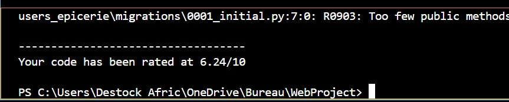
</div>

### Linters Usage
**Linters**, like **Flake8**, were integrated into the development process to:
- Verify code style compliance (PEP8).
- Identify potential errors before execution.
- Maintain high-quality code.

### Git Workflow
A rigorous Git workflow was implemented:
- **main**: Stable code.
- **dev**: Active development.
- Dedicated branches for each feature, with **pull requests** for validation.
- **Commit integration with linter results** to ensure consistent quality.

### Unit Testing
Unit tests, developed with **pytest**, were implemented to verify key functionalities. These tests ensure code reliability and detect potential regressions before deployment.

### GitHub Issues Management
**GitHub Issues** were used to organize and structure project tasks. Each issue was:
- **Tagged** according to its type (bug, feature, enhancement).
- **Tested and documented** before being closed.
- Linked to the associated branch to ensure traceability and clean code integration.

This approach ensures rigorous development tracking and facilitates team collaboration.

<div align="right">
  <a href="#top">⬆ Back to top</a>
</div>

---

## Backend Structure
````
projet/
├── admins_epicerie/
│   ├── ...
│   ├── models.py
│   ├── tests.py
│   ├── urls.py
│   └── views.py
├── gesteprice/
│   ├── ...
│   ├── asgi.py
│   ├── manage.py
│   ├── settings.py
│   ├── urls.py
│   └── wsgi.py
├── gestion_epicerie/
│   ├── views.py
│   └── ...
├── locale/
│   ├── en/
│   │   └── LC_MESSAGES/
│   │       ├── django.mo
│   │       └── django.po
│   ├── fr/
│       └── ...
├── users_epicerie/
│   ├── __pycache__/
│   ├── image/
│   ├── migrations/
│   ├── static/
│   │   └── css/
│   ├── templates/
│   ├── templatetags/
│   ├── __init__.py
│   ├── apps.py
│   ├── models.py
│   ├── tests.py
│   ├── urls.py
│   └── views.py
├── gesteprice.sql
└── manage.py
---
````

<div align="right">
  <a href="#top">⬆ Back to top</a>
</div>

---

## Getting Started

### Prerequisites

Before starting, make sure you have the following installed:

- **Python 3.9 or higher**: Required to run the backend.
- **Pip**: Python package manager.
- **MySQL**: Database used to store project information.
- **Text editor/IDE**: Recommended, such as Visual Studio Code.

### Installation and Configuration

Follow these steps to set up and run the project locally.

1. Extract the project

Download and extract the archive containing the project files. Then, open the terminal in the main directory using Visual Studio Code or another editor.

2. Import the database

Execute the following command to import the database from the `gestepice.sql` file:

```bash
mysql -u root -p gestepice < gestepice.sql
````

3. Install dependencies

```bash
pip install -r requirements.txt
```

4. Run database migrations

```bash
python manage.py makemigrations
```

5. Start the server
```bash
python manage.py runserver
```
You can now access the application by visiting http://localhost:8000 in your web browser.

<div align="right">

[⬆ Back to top](#top)

</div>

--- 

## Application Preview

This section provides a visual overview of the e-commerce application, showcasing its main features and user interfaces. The following screenshots highlight the user experience for different roles: Client, Administrator, and Supplier.

<div align="center" style="display: flex; justify-content: center; align-items: center; text-align: center; flex-direction: column;">
   <h3>Home Page - Client View</h3>
   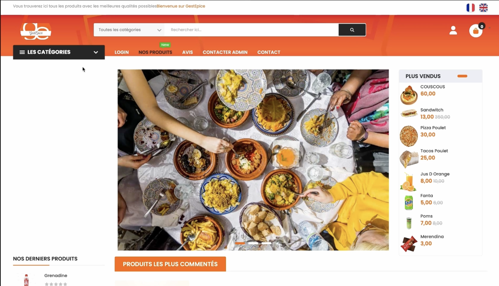
   <h3>Products and Reviews Section - Home Page</h3>
   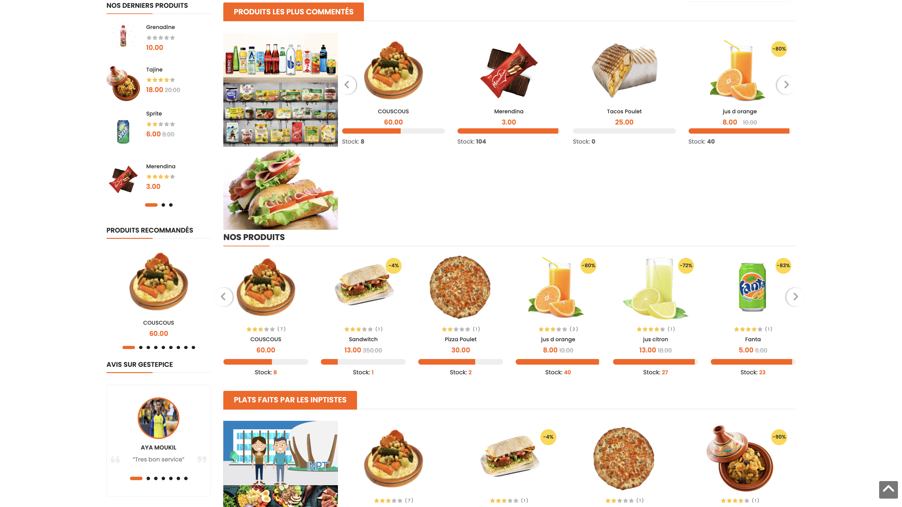
   <h3>Contact and Location Section</h3>
   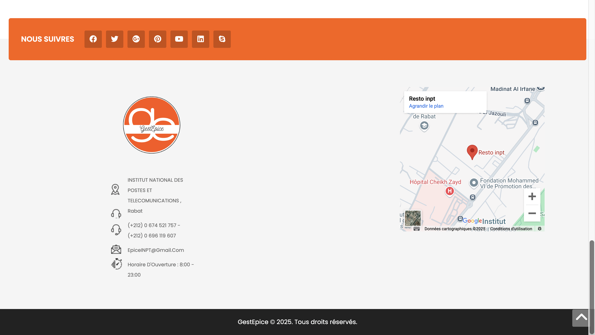
   <h3>User Shopping Cart</h3>
   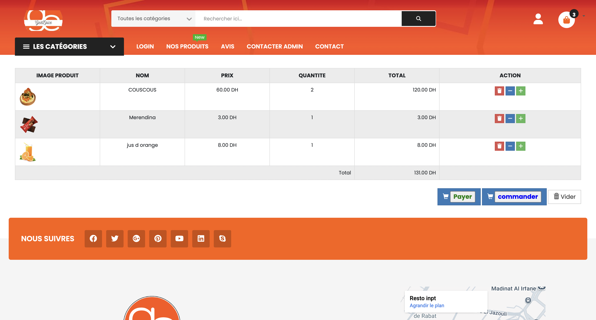
   <h3>Login and Registration Page</h3>
   
   <h3>Registration Form</h3>
   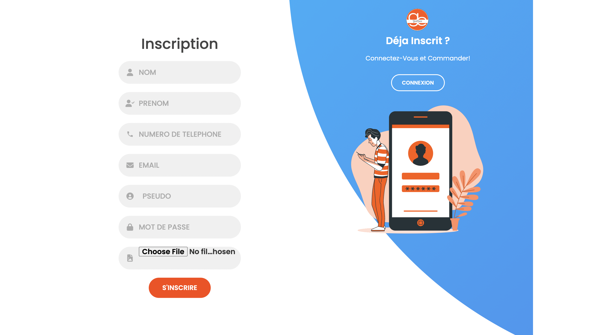
   <h3>Messaging Interface</h3>
   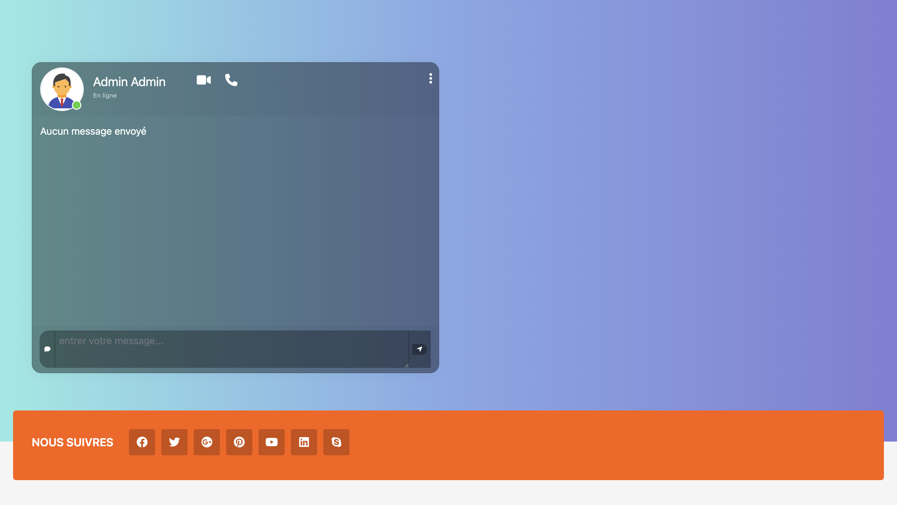
   <h3>Administrative Dashboard</h3>
   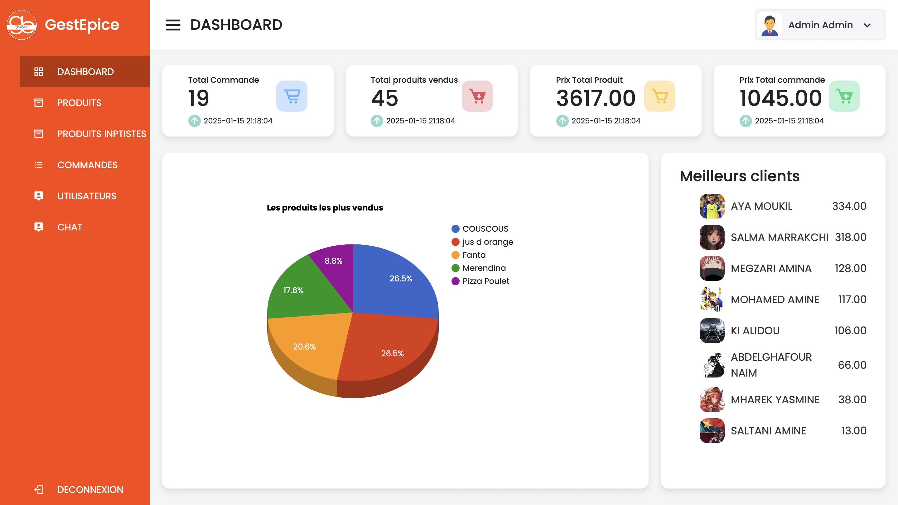
   <h3>User Management</h3>
   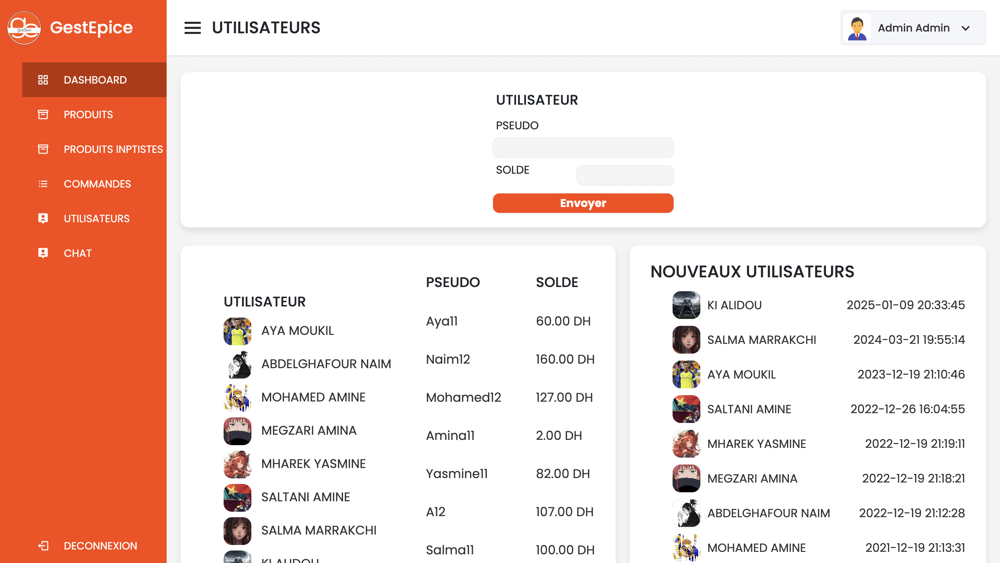
   <h3>Order Details</h3>
   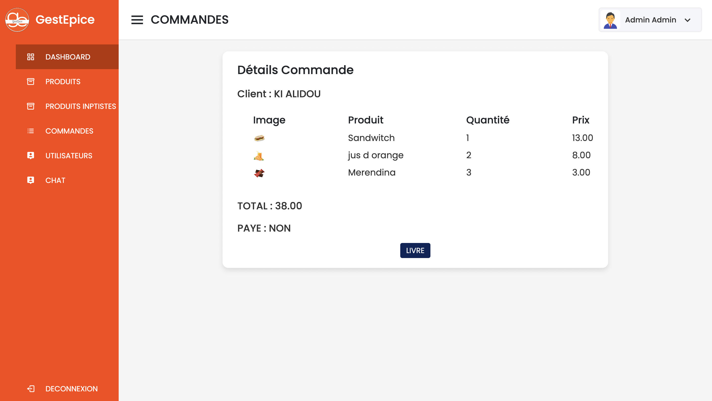
   <h3>Products and Categories</h3>
   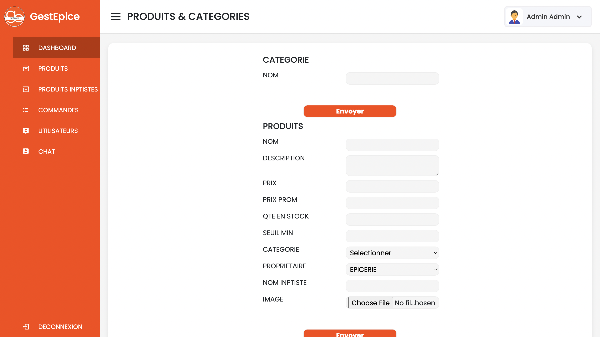
   <h3>INPT Student Products</h3>
   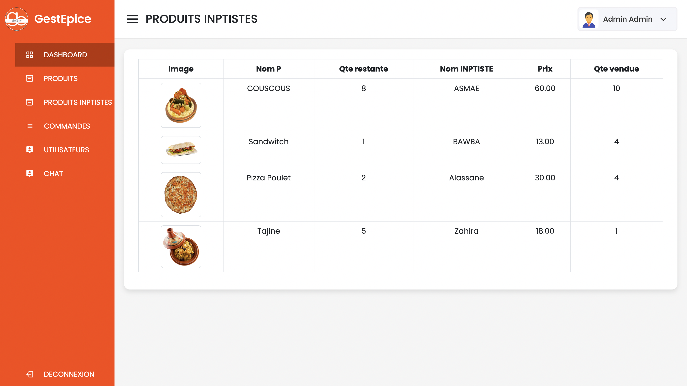
   <h3>Conversation List</h3>
   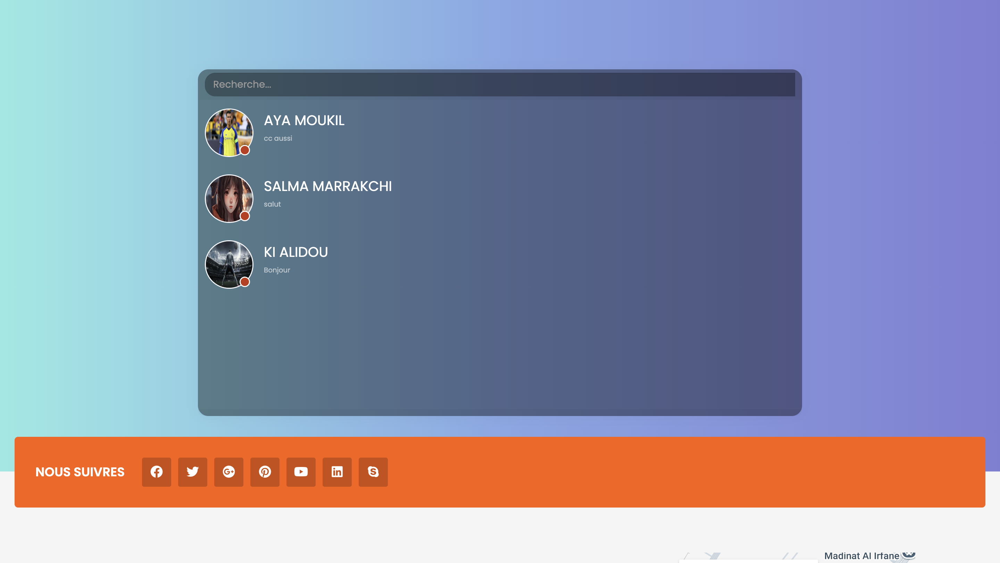
</div>

<div align="right">
  <a href="#top">⬆ Back to top</a>
</div>

---

## Database

### Conceptual Model
The conceptual model consists of the following main entities:
- **Users**: User management (name, email, role, etc.).
- **Admin**: Administrator information (username, photo, etc.).
- **Product**: Product details (name, price, description, etc.).
- **Category**: Product classification.
- **Order**: Order history.
- **Messages**: Message exchange between users.
- **Invoice**: Payment tracking.
- **Recommendations**: Suggestions based on user interactions.

### Entity-Relationship Diagram (ERD)
<div align="center" style="display: flex; justify-content: center; align-items: center; text-align: center;">
  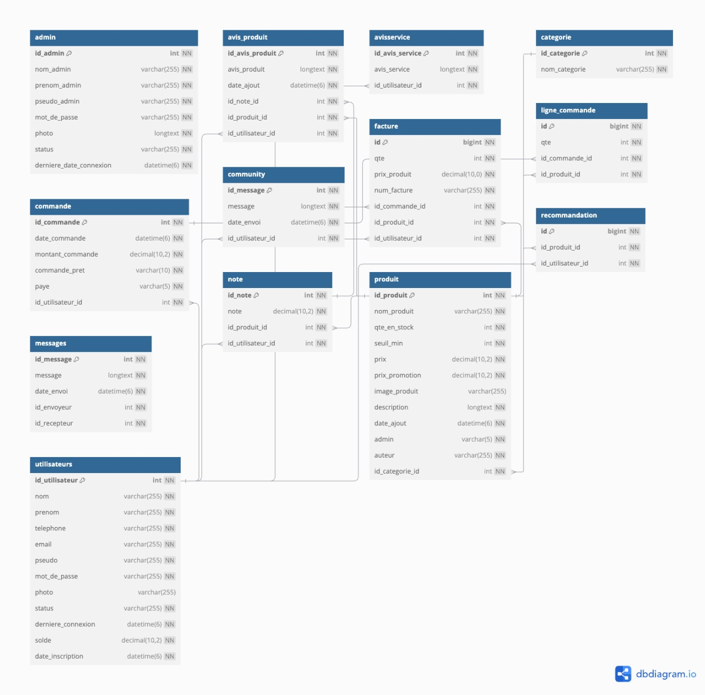
</div>

The diagram above represents the main relationships:
- **Category ⇾ Product**: A category contains multiple products.
- **Users ⇾ Order ⇾ Invoice**: A user can place multiple orders, each linked to an invoice.
- **Product ⇾ Rating & Recommendation**: Links for reviews and suggestions.

<div align="right">
  <a href="#top">⬆ Back to top</a>
</div>

---

## Contributors
<div style="display: flex; gap: 30px; justify-content: center; align-items: center; text-align: center; flex-wrap: wrap;">
  <div>
    <a href="https://github.com/s4l4h">
      
      <p>BAHAFID Salah Eddine</p>
    </a>
  </div>
  <div>
    <a href="https://github.com/Wissal-Chbani">
      
      <p>CHBANI Wissal</p>
    </a>
  </div>
  <div>
    <a href="https://github.com/Alidou26">
      
      <p>KI Alidou</p>
    </a>
  </div>
  <div>
    <a href="https://github.com/Kahisorow">
      
      <p>SBAI Yahia</p>
    </a>
  </div>
  <div>
    <a href="https://github.com/Dsaerex">
      
      <p>ZIANI Zakaria</p>
    </a>
  </div>
</div>

<div align="right">
  <a href="#top">⬆ Back to top</a>
</div>
