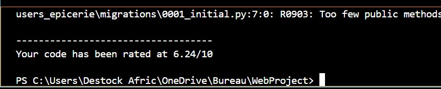
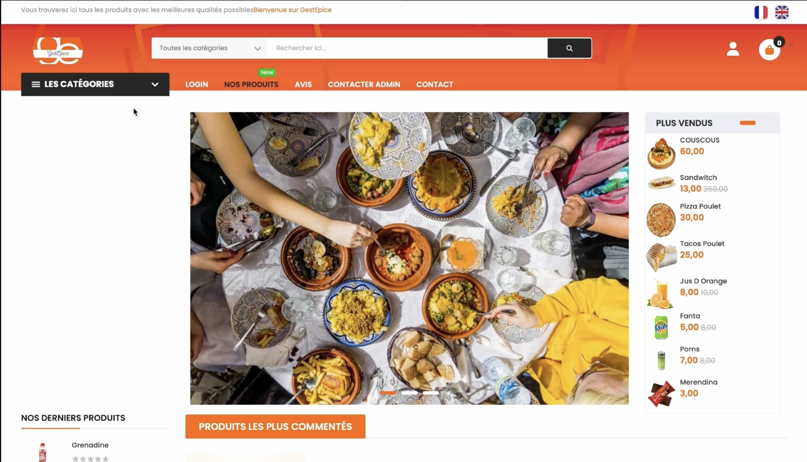
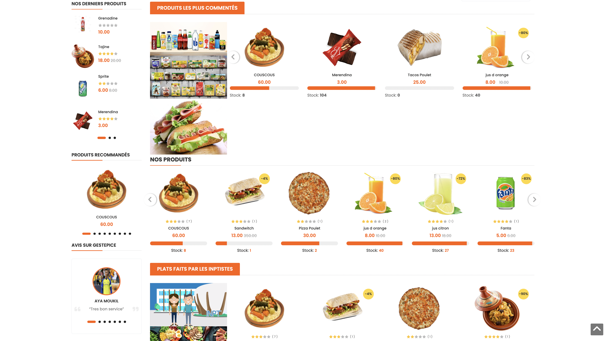
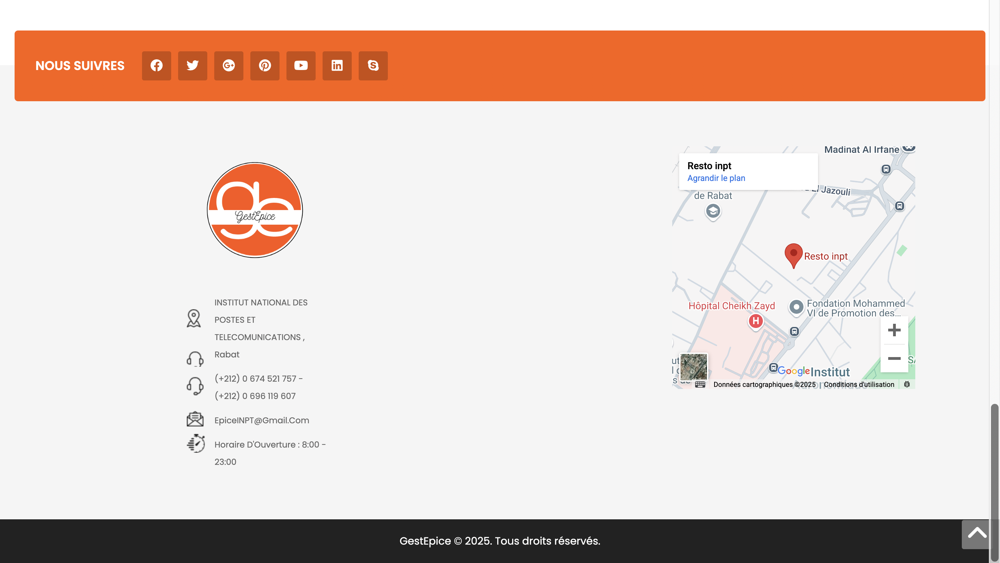
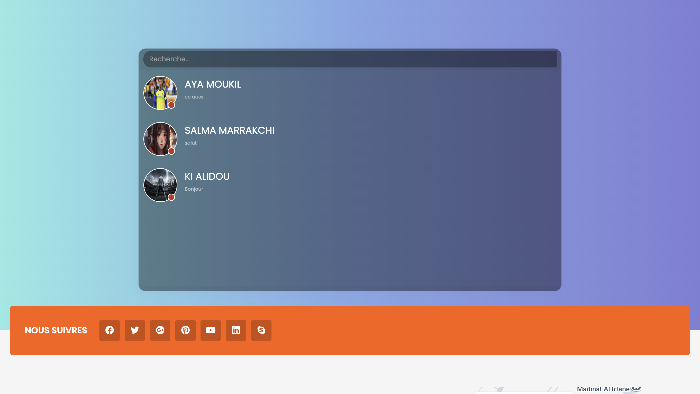
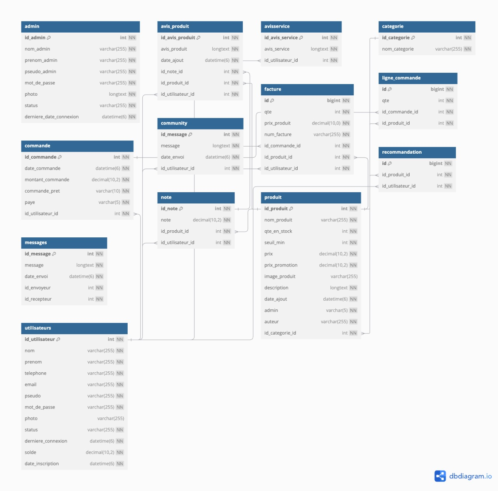

<div align="left"> <a href="./README.md">🇫🇷 Français</a> | <a href="./README.en.md">🇬🇧 English</a> </div>

---
<a name="top"></a>

# GestEpice : Plateforme de Vente de Produits pour les Étudiants de l'INPT

# [Video Démonstration](https://drive.google.com/file/d/1ANz-nvzCub14DQWWOA09ZG-OSu8fzNpx/view?usp=drive_link)
Si le lien ne marche pas, considérez de copier lien et de le coller dans la barre de recherche.

## Table des Matières

1. [Introduction](#introduction)
   - [Objectifs du Projet](#objectifs-du-projet)
   - [Description Générale](#description-générale)
2. [Technologies et Outils Utilisés](#technologies-et-outils-utilisés)
3. [Architecture et Design](#architecture-et-design)
   - [Diagramme de Classes](#diagramme-de-classes)
   - [Diagramme de Cas d'Utilisation](#diagramme-de-cas-dutilisation)
4. [Description Fonctionnelle](##description-fonctionnelle)
   - [Client](#client)
   - [Administrateur](#administrateur)
   - [Fournisseur](#fournisseur)
5. [Description Non-Fonctionnelle](#description-non-fonctionnelle)
6. [Bonnes Pratiques de Développement](#bonnes-pratiques-de-développement)
   - [Patrons de Conception](#patrons-de-conception)
   - [Conformité à SOLID et Clean Code](#conformité-à-solid-et-clean-code)
   - [Conformité à PEP8](#conformité-à-pep8)
   - [Utilisation de Linters](#utilisation-de-linters)
   - [Git Workflow](#git-workflow)
   - [Tests Unitaires](#tests-unitaires)
7. [Multilingue](#multilingue)
8. [Structure du Backend](#structure-du-backend)
9. [Prise en Main](#prise-en-main)
   - [Prérequis](#prérequis)
   - [Installation et Configuration](#installation-et-configuration)
10. [Aperçu de l’Application](#aperçu-de-lapplication)
11. [Base de Données](#base-de-données)
    - [Modèle Conceptuel](#modèle-conceptuel)
    - [Diagramme Entité-Relation (ERD)](#diagramme-entité-relation-erd)
12. [Les Contibuteurs](#les-contributeurs)

   
---


## Introduction

### Objectifs du Projet
Le projet vise à développer une plateforme e-commerce performante et sécurisée, capable de répondre aux besoins de trois types d’utilisateurs principaux : les Clients, les Administrateurs, et les Fournisseurs. Les principaux objectifs sont :
- **Fournir une expérience utilisateur intuitive** grâce à une interface simple et fluide.
- **Automatiser les processus métiers** comme la gestion des produits, commandes et rapports.
- **Assurer la sécurité des données** en utilisant des techniques modernes de chiffrement et de gestion des utilisateurs.
- **Permettre une évolutivité facile** en adoptant une architecture modulaire et conforme aux bonnes pratiques.
- **Faciliter l’intégration multilingue** pour rendre la plateforme accessible à un large public.

### Description Générale
La plateforme e-commerce est une application web complète et modulable conçue pour répondre aux besoins variés des utilisateurs. Elle repose sur :
- **Un backend robuste** développé avec **Django**, couplé à une base de données relationnelle **MySQL**, garantissant la fiabilité des opérations et la gestion des données.
- **Une architecture modulaire** conforme aux principes SOLID et CLEAN CODE, facilitant la maintenabilité et l’extensibilité du projet.
- **Un système multilingue générique**, permettant d’ajouter facilement de nouvelles langues pour une meilleure accessibilité.
- **Un mécanisme de sécurité avancé**, intégrant le hachage des mots de passe et la gestion des rôles utilisateurs (Clients, Administrateurs, Fournisseurs).
- **Des fonctionnalités sur mesure** :
  - **Pour les Clients** : Recherche de produits, gestion des commandes, et suivi des achats.
  - **Pour les Administrateurs** : Gestion des produits et catégories, tableau de bord statistique, et interaction via le chat.
  - **Pour les Fournisseurs** : Ajout de produits, suivi des commandes, et consultation des rapports de vente.

Ce projet est conçu pour être à la fois performant, maintenable et facilement déployable dans un environnement de production.


<div align="right">

[⬆ Back to top](#top)

</div>


---


## Technologies et Outils Utilisés

Le projet repose sur une stack technologique moderne et des outils robustes pour assurer sa performance, sa maintenabilité, et sa sécurité. Voici les principaux éléments utilisés :

### Backend
- 
- 
- 

### Frontend
- &nbsp;&nbsp;
- 

### Outils DevOps et Build
- 
- 
- 
- 

### Tests et Qualité
- 
- 

### Sécurité
- 
- 

### Outils Supplémentaires
- 
- 

Cette combinaison de technologies garantit une application robuste, maintenable et facile à étendre.

<div align="right">

[⬆ Back to top](#top)

</div>


---

## Architecture et Design

### Diagramme de Classes

*Description*  
Le diagramme de classes ci-dessous représente la structure conceptuelle du projet e-commerce, en montrant les principales entités (Client, Admin, Supplier, Product, Order, Review, et Chat) ainsi que leurs relations. Il est essentiel pour comprendre l'organisation des données et des interactions dans le système.

*Diagramme*
<div align="center" style="display: flex; justify-content: center; align-items: center; text-align: center;">
  
</div>

---

### Diagramme de Cas d'Utilisation

*Description*  
Le diagramme de cas d'utilisation ci-dessous représente les principales interactions entre les acteurs du système (Client, Admin, Supplier) et les fonctionnalités qu'ils peuvent effectuer. Les cas d'utilisation communs à plusieurs acteurs (comme "S'inscrire et se connecter" et "Contacter via le chat") sont également mis en évidence.

*Diagramme*
<div align="center" style="display: flex; justify-content: center; align-items: center; text-align: center;">
  
</div>


<div align="right">

[⬆ Back to top](#top)

</div>


---


## Description Fonctionnelle

### Utilisateurs et Rôles

#### **Client**
Le client peut :
- S'inscrire et se connecter.
- Modifier ses informations de profil.
- Ajouter un avis sur le service Gestepice.
- Ajouter un avis et recommander des produits.
- Rechercher des produits par catégorie et/ou mot-clé.
- Consulter la liste de ses commandes et imprimer les factures.
- Ajouter des produits au panier et passer une commande.
- Contacter l'administrateur via un chat en temps réel.

#### **Administrateur**
L'administrateur peut :
- Consulter les différentes statistiques de l’épicerie via un **dashboard interactif**.
- Ajouter, modifier et supprimer des produits et catégories.
- Consulter la liste des commandes passées.
- Consulter la liste des produits fabriqués par les étudiants de l'INPT et gérer les paiements pour ces derniers.
- Recharger le solde des utilisateurs.
- Répondre aux préoccupations des clients via un chat.

#### **Fournisseur**
Le fournisseur peut :
- S'inscrire et se connecter pour accéder à son espace dédié.
- Ajouter, modifier et supprimer ses produits disponibles sur la plateforme.
- Consulter les commandes des clients pour ses produits spécifiques.
- Suivre l’état de paiement pour les commandes de ses produits.
- Recevoir des notifications pour les commandes des clients.
- Gérer les stocks et voir les alertes en cas de rupture de stock.
- Télécharger un rapport des ventes mensuelles pour ses produits.


<div align="right">

[⬆ Back to top](#top)

</div>

---


## Description Non-Fonctionnelle

### Exigences Techniques
1. **Architecture** :
   - Basée sur le framework Django MVC.
   - Structure modulaire et réutilisable avec des apps Django.

2. **Performance** :
   - Temps de réponse inférieur à 2 secondes pour toutes les requêtes utilisateur.

3. **Sécurité** :
   - Hachage sécurisé des mots de passe avec la fonction de hachage Python (`hashlib`).
   - Validation des entrées utilisateur pour prévenir les failles courantes telles que les injections SQL et XSS.
   - Utilisation de Django pour la gestion des sessions et de l’authentification.
   - Prévention des attaques CSRF et XSS via les middlewares Django.

5. **Portabilité** :
   - Compatible avec les principaux navigateurs (Chrome, Firefox, Edge).

6. **Base de Données** :
   - MySQL pour la base relationnelle.


<div align="right">

[⬆ Back to top](#top)

</div>


---


## Multilingue

Django prend en charge l’internationalisation (**i18n**) pour développer des applications multilingues. Voici les étapes clés mises en œuvre pour intégrer le multilingue dans ce projet :

1. **Marquage des chaînes de caractères** :
   - Dans les **templates** : Les chaînes traduisibles sont entourées par ``.
   - Dans le **code Python** : Les chaînes sont marquées avec `_()`.

2. **Extraction des chaînes traduisibles** :
   - La commande suivante a été utilisée pour générer les fichiers `.po` contenant les chaînes traduisibles :
     ```bash
     django-admin makemessages -l <code_langue>
     ```
     > Exemple : `django-admin makemessages -l fr` pour le français.

3. **Ajout des traductions** :
   - Les fichiers `.po` générés ont été remplis avec les traductions nécessaires.

4. **Compilation des fichiers de traduction** :
   - Les fichiers `.po` ont été compilés en fichiers `.mo` à l’aide de la commande suivante :
     ```bash
     django-admin compilemessages
     ```

5. **Sélection automatique de la langue** :
   - Le **LocaleMiddleware** a été activé pour que Django sélectionne automatiquement la langue en fonction :
     - Des préférences de l’utilisateur.
     - De l’URL (si configuré).

6. **Ajout d’un sélecteur de langue** :
   - Une interface a été implémentée pour permettre aux utilisateurs de changer de langue facilement.

L’application adapte son contenu à la langue préférée de l’utilisateur, offrant une expérience fluide et personnalisée.


<div align="right">

[⬆ Back to top](#top)

</div>

---


## Bonnes Pratiques de Développement

### Patrons de Conception
Les **patrons de conception** tels que Singleton, DAO, et MVC ont été utilisés pour structurer le code de manière modulaire, facilitant la réutilisation et la maintenabilité.

### Conformité à SOLID et Clean Code
Le code respecte les principes **SOLID** pour assurer une architecture robuste et scalable, tout en suivant les pratiques **Clean Code** pour améliorer la lisibilité et réduire les erreurs.

### Conformité à PEP8
Tout le code Python suit les normes **PEP8** **[REFERENCE](https://peps.python.org/pep-0008/)** pour garantir un style cohérent, ce qui facilite la collaboration en équipe et réduit les problèmes liés au formatage.
<div align="center" style="display: flex; justify-content: center; align-items: center; text-align: center;">
  
</div>

### Utilisation de Linters
Des **linters**, comme **Flake8**, ont été intégrés dans le processus de développement pour :
- Vérifier la conformité au style de code (PEP8).
- Identifier les erreurs potentielles avant l'exécution.
- Maintenir un code de haute qualité.

### Git Workflow
Un workflow Git rigoureux a été mis en place :
- **main** : Code stable.
- **dev** : Développement actif.
- Branches dédiées pour chaque fonctionnalité, avec des **pull requests** pour validation.
- **Intégration des commits avec les résultats des linters** pour garantir une qualité constante.

### Tests Unitaires
Des tests unitaires, développés avec **pytest**, ont été mis en place pour vérifier les fonctionnalités clés. Ces tests garantissent la fiabilité du code et détectent les éventuelles régressions avant le déploiement.

### Gestion des Issues GitHub
Les **issues GitHub** ont été utilisées pour organiser et structurer les tâches du projet. Chaque issue a été :
- **Taguée** selon son type (bug, feature, enhancement).
- **Testée et documentée** avant d’être fermée.
- Liée à la branche associée pour assurer une traçabilité et une intégration propre dans le code.

Cette approche garantit un suivi rigoureux du développement et facilite la collaboration en équipe.


<div align="right">

[⬆ Back to top](#top)

</div>


---

## Structure du Backend
````
projet/
├── admins_epicerie/
│   ├── ...
│   ├── models.py
│   ├── tests.py
│   ├── urls.py
│   └── views.py
├── gesteprice/
│   ├── ...
│   ├── asgi.py
│   ├── manage.py
│   ├── settings.py
│   ├── urls.py
│   └── wsgi.py
├── gestion_epicerie/
│   ├── views.py
│   └── ...
├── locale/
│   ├── en/
│   │   └── LC_MESSAGES/
│   │       ├── django.mo
│   │       └── django.po
│   ├── fr/
│       └── ...
├── users_epicerie/
│   ├── __pycache__/
│   ├── image/
│   ├── migrations/
│   ├── static/
│   │   └── css/
│   ├── templates/
│   ├── templatetags/
│   ├── __init__.py
│   ├── apps.py
│   ├── models.py
│   ├── tests.py
│   ├── urls.py
│   └── views.py
├── gesteprice.sql
└── manage.py
---
````


<div align="right">

[⬆ Back to top](#top)

</div>

---

## Prise en Main

### Prérequis

Avant de commencer, assurez-vous d'avoir installé les éléments suivants :

- **Python 3.9 ou supérieur** : Nécessaire pour exécuter le backend.
- **Pip** : Gestionnaire de packages Python.
- **MySQL** : Base de données utilisée pour stocker les informations du projet.
- **Un éditeur de texte/IDE** : Recommandé, comme Visual Studio Code.

### Installation et Configuration

Suivez ces étapes pour configurer et exécuter le projet localement.

1. Décompressez le projet

Téléchargez et décompressez l'archive contenant les fichiers du projet. Ensuite, ouvrez le terminal dans le répertoire principal à l'aide de Visual Studio Code ou d'un autre éditeur.

2. Importez la base de données

Exécutez la commande suivante pour importer la base de données à partir du fichier `gestepice.sql` :

```bash
mysql -u root -p gestepice < gestepice.sql
````

3. Installez les dépendances

```bash
pip install -r requirements.txt
```

4. Effectuez les migrations de la base de données

```bash
python manage.py makemigrations
```

5. Lancez le serveur
```bash
python manage.py runserver
```
Maintenant, vous pouvez accéder à l'application en visitant http://localhost:8000 dans votre navigateur web.


<div align="right">

[⬆ Back to top](#top)

</div>


--- 

## Aperçu de l’Application

Cette section présente un aperçu visuel de l’application e-commerce, illustrant ses principales fonctionnalités et interfaces utilisateur. Les captures d’écran suivantes mettent en évidence l'expérience utilisateur pour les différents rôles : Client, Administrateur, et Fournisseur.

<div align="center" style="display: flex; justify-content: center; align-items: center; text-align: center;">
   <h3>Page d'Accueil - Vue Client</h3>
   
   <h3>Section des Produits et Avis - Page d'Accueil</h3>
   
   <h3>Section de Contact et Localisation</h3>
   
   <h3>Panier d'Achat des Utilisateurs</h3>
   
   <h3>Page de Connexion et d'Inscription</h3>
   
   <h3>Formulaire d'Inscription</h3>
   
   <h3>Interface de Messagerie</h3>
   
   <h3>Tableau de Bord Administratif</h3>
   
   <h3>Gestion des Utilisateurs</h3>
   
   <h3>Détails de Commande</h3>
   
   <h3>Produits et Catégories</h3>
   
   <h3>Produits INPTistes</h3>
   
   <h3>Liste des Conversations</h3>
   
</div>

<div align="right">

[⬆ Back to top](#top)

</div>

---

## Base de Données

### Modèle Conceptuel
Le modèle conceptuel se compose des entités principales suivantes :
- **Users** : Gestion des utilisateurs (nom, email, rôle, etc.).
- **Admin** : Informations des administrateurs (pseudo, photo, etc.).
- **Produit** : Détails des produits (nom, prix, description, etc.).
- **Catégorie** : Classification des produits.
- **Commande** : Historique des commandes.
- **Messages** : Échange de messages entre utilisateurs.
- **Facture** : Suivi des paiements.
- **Recommandations** : Suggestions basées sur les interactions utilisateur.

### Diagramme Entité-Relation (ERD)
<div align="center" style="display: flex; justify-content: center; align-items: center; text-align: center;">
  
</div>

Le diagramme ci-dessus représente les relations principales :
- **Catégorie ⇾ Produit** : Une catégorie contient plusieurs produits.
- **Users ⇾ Commande ⇾ Facture** : Un utilisateur peut effectuer plusieurs commandes, chacune liée à une facture.
- **Produit ⇾ Note & Recommandation** : Liens pour les avis et suggestions.

<div align="right">

[⬆ Back to top](#top)

</div>

---


## Les Contributeurs
<div style="display: flex; gap: 30px; justify-content: center; align-items: center; text-align: center; flex-wrap: wrap;">
  <div>
    <a href="https://github.com/s4l4h">
      
      <p>BAHAFID Salah Eddine</p>
    </a>
  </div>
  <div>
    <a href="https://github.com/Wissal-Chbani">
      
      <p>CHBANI Wissal</p>
    </a>
  </div>
  <div>
    <a href="https://github.com/Alidou26">
      
      <p>KI Alidou</p>
    </a>
  </div>
  <div>
    <a href="https://github.com/Kahisorow">
      
      <p>SBAI Yahia</p>
    </a>
  </div>
  <div>
    <a href="https://github.com/Dsaerex">
      
      <p>ZIANI Zakaria</p>
    </a>
  </div>
</div>


<div align="right">

[⬆ Back to top](#top)

</div>


